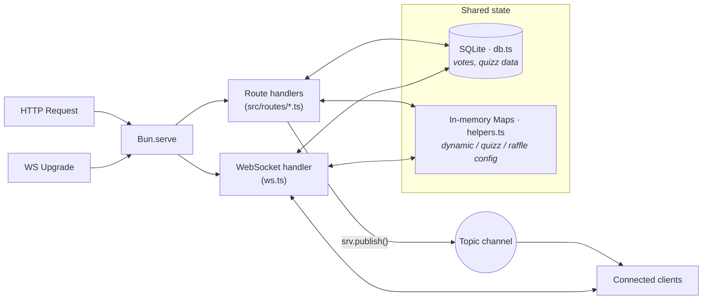
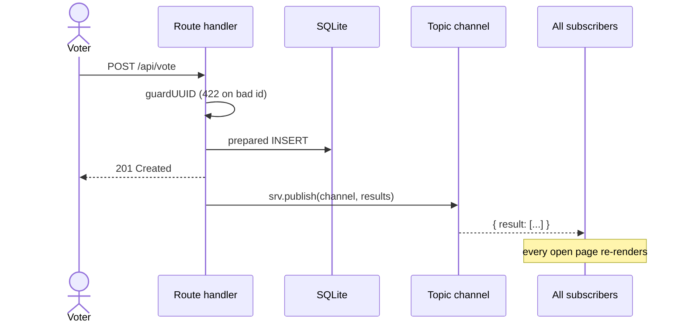
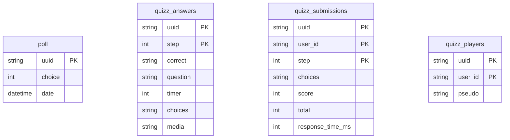

# Architecture

Pollux is a single-file Bun server with a modular route structure. This page explains how the pieces fit together.

## Overview

Everything runs in a single `Bun.serve` process. HTTP handlers and the WebSocket
handler share two stores: a **persistent** SQLite database and a set of
**ephemeral** in-memory maps (see [State & data model](state-model.md)).



## Project structure

```
src/
  index.ts          — Server entry point, assembles routes
  db.ts             — SQLite queries (poll, quizz tables)
  routes/
    helpers.ts      — Shared types, maps, response helpers
    pages.ts        — Static HTML page routes
    assets.ts       — CSS/JS asset routes
    uuid.ts         — UUID generation endpoint
    vote.ts         — Vote submission and results
    dynamic.ts      — Dynamic poll step management
    quizz.ts        — Quiz creation, voting, scoring
    raffle.ts       — Raffle registration, spin, status
    ws.ts           — WebSocket handler + upgrade logic
  scoring.ts        — Pure quiz-scoring logic (speed bonus)
  raffle-logic.ts   — Pure pseudo generation + winner draw
  layout/           — HTML page templates
  scripts/          — Client-side JavaScript
  styles/           — CSS stylesheets
```

Domain logic that would otherwise be buried in route handlers lives in its own
pure, dependency-free modules (`scoring.ts`, `raffle-logic.ts`) so it can be
unit-tested in isolation.

## Routing

Pollux uses Bun's built-in route matching (`Bun.serve` with `routes` option). Routes are defined as an object where keys are URL patterns and values are handler functions or method-specific handler objects.

Route handlers are extracted into separate files under `src/routes/` for maintainability. Each file exports an object that is spread into the main routes object in `index.ts`.

## Request lifecycle

A mutating request (a vote) never replies with the new results directly — it
persists, then lets the WebSocket fan-out deliver the update to everyone,
including the caller.



Every endpoint validates the poll id with `guardUUID` / `isUUIDv7` (UUIDv7-only)
and returns **422** on mismatch. Handlers build responses through the shared
helpers in `helpers.ts` (`json`, `invalid`, `notFound`, `html`, `js`) so CORS
headers stay consistent.

## Database

Pollux uses SQLite via `bun:sqlite` with WAL mode for better concurrent access. The database file is stored at `data/db.sqlite`.

### Tables



Only votes and quizz data are persisted here. **Raffle state (players and
winner) lives only in memory** and is lost on restart — see
[State & data model](state-model.md) for the full picture and for the
choice-encoding scheme used by multi-round polls.

Data older than 4 hours is cleaned up automatically via a cron job.
