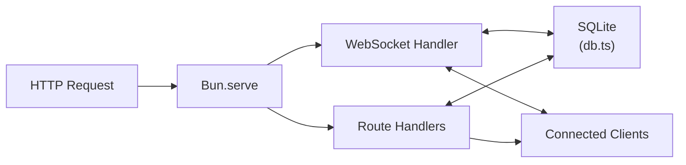
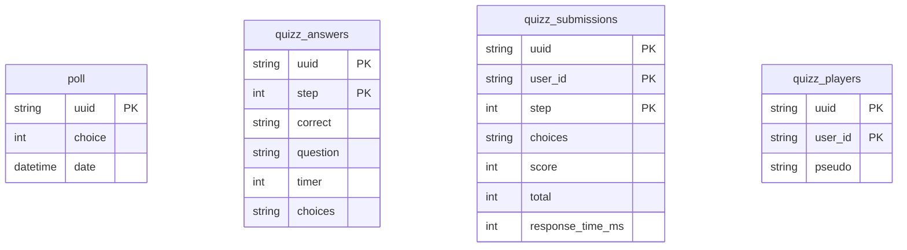

# Architecture

Pollux is a single-file Bun server with a modular route structure. This page explains how the pieces fit together.

## Overview



## Project structure

```
src/
  index.ts          — Server entry point, assembles routes
  db.ts             — SQLite queries (poll, quizz tables)
  routes/
    helpers.ts      — Shared types, maps, response helpers
    pages.ts        — Static HTML page routes
    assets.ts       — CSS/JS asset routes
    uuid.ts         — UUID generation endpoint
    vote.ts         — Vote submission and results
    dynamic.ts      — Dynamic poll step management
    quizz.ts        — Quiz creation, voting, scoring
    ws.ts           — WebSocket handler + upgrade logic
  layout/           — HTML page templates
  scripts/          — Client-side JavaScript
  styles/           — CSS stylesheets
```

## Routing

Pollux uses Bun's built-in route matching (`Bun.serve` with `routes` option). Routes are defined as an object where keys are URL patterns and values are handler functions or method-specific handler objects.

Route handlers are extracted into separate files under `src/routes/` for maintainability. Each file exports an object that is spread into the main routes object in `index.ts`.

## Data flow

1. A client sends an HTTP request (vote) or connects via WebSocket
2. The route handler validates the UUID, processes the request
3. Data is written to SQLite via prepared statements
4. Results are broadcast to all WebSocket subscribers on the poll's channel
5. Connected clients receive the update and re-render

## Database

Pollux uses SQLite via `bun:sqlite` with WAL mode for better concurrent access. The database file is stored at `data/db.sqlite`.

### Tables



Data older than 4 hours is cleaned up automatically via a cron job.
