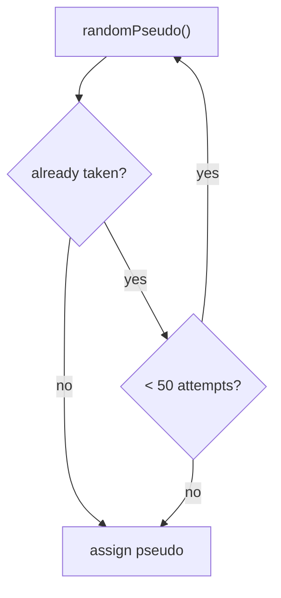
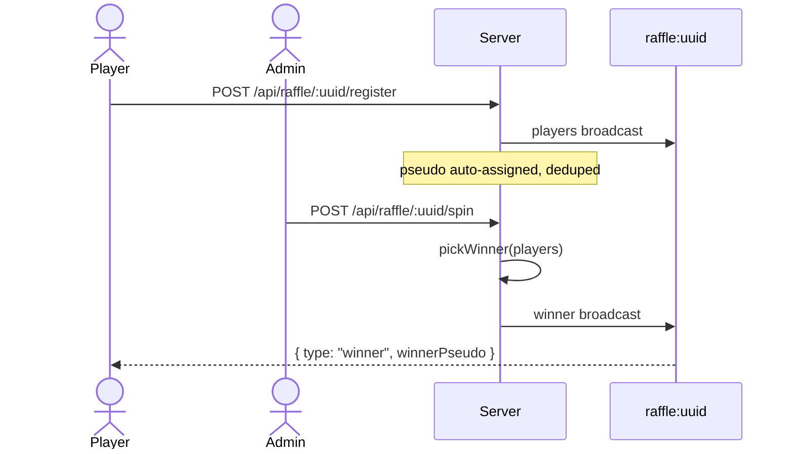

# Raffles

The raffle mode turns a poll UUID into a live prize draw: players open a page,
get an auto-generated pseudonym, and the admin spins a wheel to pick one winner
broadcast to every screen at once.

## In-memory only

Unlike votes and quizzes, **raffle state is never written to SQLite**. Players
and the drawn winner live in the `rafflePolls` map in `helpers.ts`, so a server
restart wipes the draw entirely (see [State & data model](state-model.md)).
This is deliberate: a raffle is a one-shot event, not a record to keep.

## Pseudonyms

Players don't type a name — the server assigns one from two French word lists
(adjective + animal, e.g. *Renard Malin*) in `raffle-logic.ts`. Generation is a
pure function with an **injectable rng**, which is what makes it unit-testable.

To avoid two players sharing a name, `uniquePseudo` retries against the set of
names already taken, giving up after 50 attempts rather than looping forever if
the space is exhausted:

## Drawing a winner

`pickWinner` selects one entry uniformly at random from the registered players.
The spin requires **at least 2 players**. The result is stored in the map and
published on the `raffle:<uuid>` channel, so late-joining clients that connect
after the draw still receive the winner in the WebSocket `open` handler.

## See also

- [Raffle tutorial](../tutorials/raffle.md) — run one end to end
- [WebSocket protocol](../reference/websocket.md) — raffle event payloads
- [API reference](../reference/api.md) — raffle endpoints
