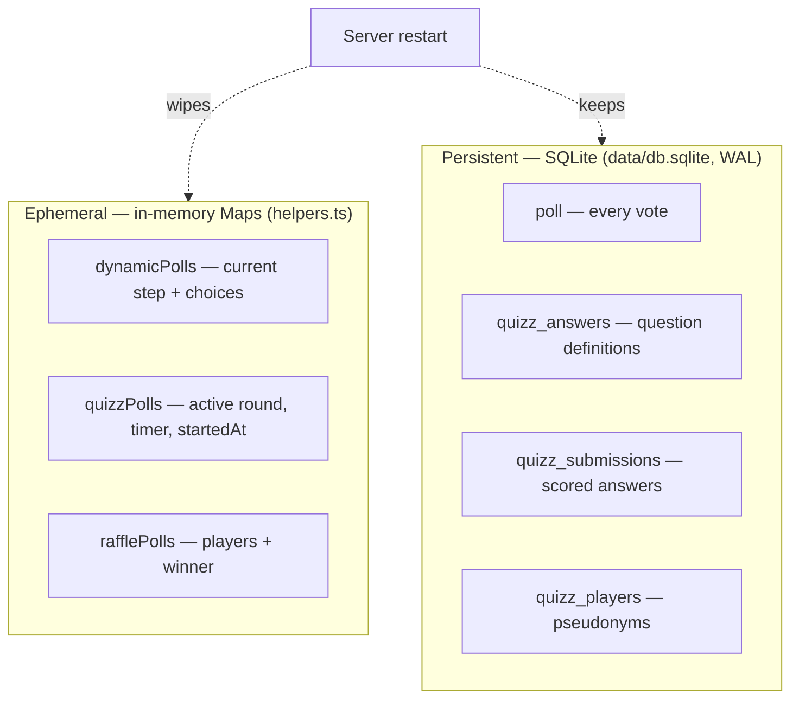
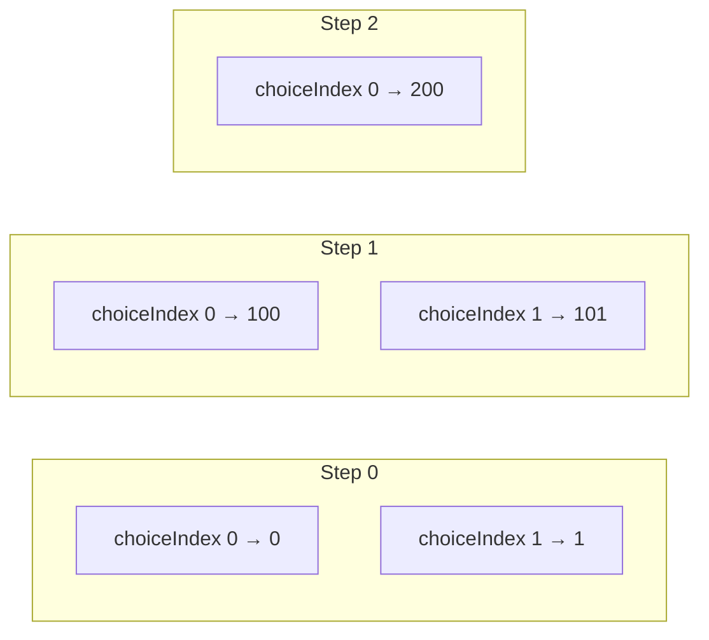
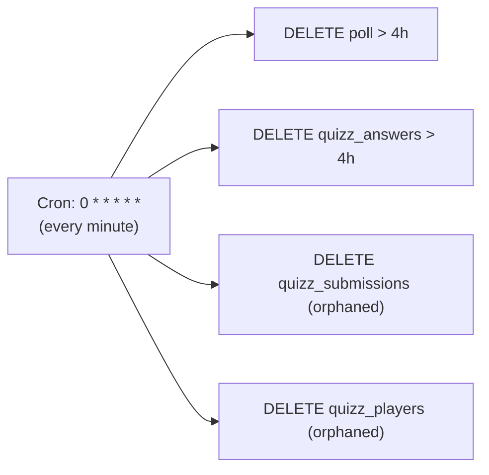

# State & data model

Pollux keeps state in **two tiers** with very different durability guarantees.
Understanding which tier holds what explains why some things survive a restart
and others don't.

## Two tiers



| Concern | Tier | Survives restart? |
|---|---|---|
| Static & dynamic votes | SQLite `poll` | ✅ |
| Quizz answers / submissions / players | SQLite `quizz_*` | ✅ |
| Dynamic/quizz **round definitions** | in-memory Maps | ❌ (quizz answers are re-hydratable from `quizz_answers`) |
| Raffle players **and** winner | in-memory Maps | ❌ — lost entirely |

The maps hold *session configuration* — what's happening right now. The database
holds *facts* — what was voted. Because everything Pollux stores is transient by
design, this split is intentional rather than a limitation.

## Choice encoding for multi-round polls

Dynamic polls and quizzes squeeze the round number into the choice integer, so a
single flat `poll.choice` column can serve every step:

```
choice = step × 100 + choiceIndex        (max 100 choices per step)
```



Result aggregation reverses it: `getResultsByStep` filters
`choice BETWEEN step*100 AND step*100+99`. Static polls skip the scheme and store
raw choice indices. Keep this in mind whenever you touch vote storage or result
aggregation.

## Data lifecycle

Nothing is meant to live long. A [`croner`](https://github.com/hexagon/croner)
job in `index.ts` fires every minute and purges anything older than four hours,
plus orphaned quizz rows.



See [Configuration](../reference/configuration.md) for how to change the
retention window or disable cleanup.
