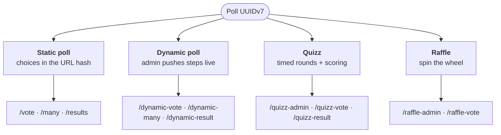

# Pollux

Pollux is a real-time polling and quiz server built with [Bun](https://bun.sh/). It lets you create live polls, dynamic multi-step polls, and quizzes where results update instantly via WebSockets.

## Quick start

```bash
bun install
bun src/index.ts
```

Open [http://localhost:3000](http://localhost:3000) and start voting.

## Key features

- **Static polls** — Simple yes/no or multiple-choice polls with live results
- **Dynamic polls** — Admin pushes new questions in real time; participants vote step by step
- **Quizzes** — Timed questions with scoring, speed bonuses, and a podium
- **Raffles** — Random draw with a spinning wheel, auto-assigned pseudonyms, and real-time winner announcement
- **Real-time** — WebSocket-based subscriptions push results to all connected clients
- **Zero config** — SQLite database, no external dependencies

## The four modes

Every mode is a set of pages sharing one poll UUID, kept in sync over a WebSocket channel.



| Mode | Who drives it | Learn more |
|---|---|---|
| Static poll | Choices encoded client-side; server only counts | [Create a poll](tutorials/create-poll.md) |
| Dynamic poll | Admin pushes each step server-side | [Dynamic polls](tutorials/dynamic-polls.md) |
| Quizz | Admin-driven rounds with answers and timers | [Quizz](tutorials/quizz.md) |
| Raffle | Auto-registered players, admin spins | [Raffle](tutorials/raffle.md) |

## Documentation structure

This documentation follows the [Diátaxis](https://diataxis.fr/) framework:

| Section | Purpose |
|---|---|
| [Tutorials](tutorials/) | Step-by-step lessons to learn Pollux |
| [How-to guides](how-to/) | Practical solutions for specific tasks |
| [Explanation](explanation/) | Background and concepts |
| [Reference](reference/) | Technical specifications and API docs |
