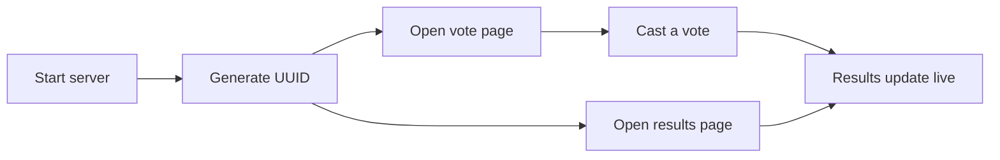

# Getting started

This tutorial walks you through running Pollux and creating your first poll in about 5 minutes.



## Prerequisites

- [Bun](https://bun.sh/) 1.2 or later
- A terminal and a web browser

## 1. Start the server

```bash
bun install
bun src/index.ts
```

You should see:

```
Pollux is running on http://localhost:3000
```

## 2. Generate a poll UUID

Open [http://localhost:3000](http://localhost:3000). You'll see the Pollux home page with a generated UUID and links to the vote and results pages.


The UUID is a [UUIDv7](https://en.wikipedia.org/wiki/Universally_unique_identifier#Version_7_(timestamp_and_random)) that identifies your poll.

## 3. Open the vote page

Click the **Vote page** link (or go to `/vote#YOUR_UUID`). You'll see buttons for each choice.

## 4. Cast a vote

Click a choice. The vote is recorded immediately and the button becomes disabled (one vote per session).

## 5. Watch results

Open the **Results page** (`/results?uuid=YOUR_UUID`) in another tab. Results update in real time as votes come in.

## What's next

Now that you have a basic poll running, try:
- [Creating a dynamic poll](dynamic-polls.md) with admin-controlled steps
- [Running a quiz](quizz.md) with timed questions and scoring
