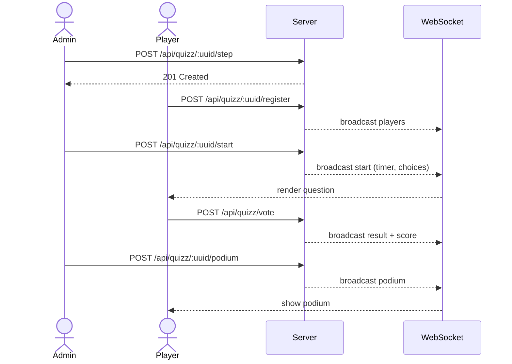

# Quizz

Pollux includes a full quiz system with timed questions, multiple correct answers, scoring, and a podium.

## How it works



## Run a quiz

### 1. Generate a quiz UUID

```bash
curl http://localhost:3000/api/uuid
```

### 2. Open the admin page

Go to [http://localhost:3000/quizz-admin#YOUR_UUID](http://localhost:3000/quizz-admin#YOUR_UUID).

### 3. Create a question

Fill in the form:

- **Step** — Question number (starts at 0)
- **Question** — The question text
- **Timer (s)** — Default timer duration in seconds
- **Media URL** — Optional URL to an image, video, or audio file (displayed on the result page)
- **Choices** — Comma-separated list (e.g., `Paris, London, Berlin, Madrid`)
- **Correct** — 0-based indices of correct answers (e.g., `0, 2`)

Click **Save Step**.

### 4. Open the vote page

Go to [http://localhost:3000/quizz-vote#YOUR_UUID](http://localhost:3000/quizz-vote#YOUR_UUID).

Enter a pseudonym to register.

### 5. Start the question

Back on the admin page, set a timer and click **Start**. The question appears on all player screens.

### 6. Submit answers

Players select the correct answers and click **Submit Answer**. Points are awarded for correct answers plus a speed bonus for fast responses.

### 7. View results

Open [http://localhost:3000/quizz-result?uuid=YOUR_UUID](http://localhost:3000/quizz-result?uuid=YOUR_UUID) to see the live results display, leaderboard, and podium.

## Scoring

- **Correct answer**: +1 point per correct selection
- **Speed bonus**: Up to +1 extra point per correct answer, decreasing linearly from 20 seconds
- **Total**: Correct answers + speed bonus

## WebSocket events

Clients connected to `/ws/quizz?uuid=YOUR_UUID&user=USER_ID` receive:

| Event | Payload | Description |
|---|---|---|
| `players` | `{ "players": [...] }` | Updated player list |
| `start` | `{ "step": 0, "choices": [...], "timer": 30, "startedAt": ..., "media": "..." }` | Question started |
| `result` | `{ "step": 0, "result": [...] }` | Step results |
| `score` | `{ "step": 0, "scores": [...] }` | Step scores |
| `podium` | `{ "scores": [...] }` | Final podium |
