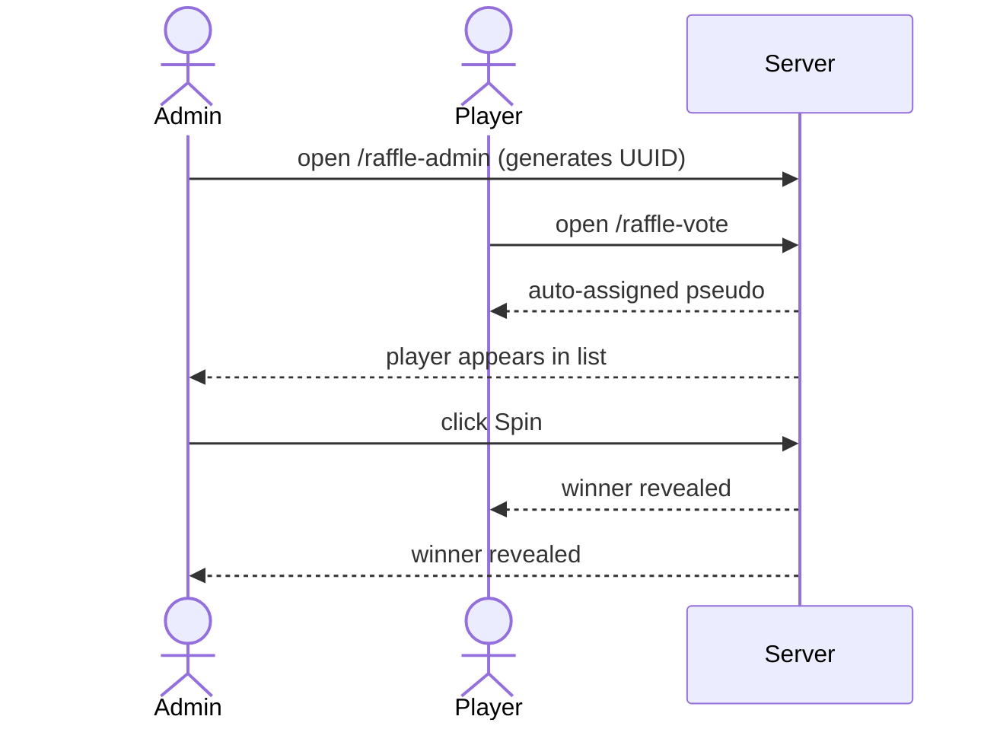

# Raffle

Run a live prize draw: players join from their phones, each gets a random
pseudonym, and you spin a wheel to pick one winner shown on every screen at once.



## 1. Start the server

```bash
bun src/index.ts
```

## 2. Open the admin page

Go to [http://localhost:3000/raffle-admin](http://localhost:3000/raffle-admin).
A UUID is generated for you; share the **vote link** it shows (or the QR code)
with your audience.

## 3. Players join

Each participant opens `/raffle-vote#YOUR_UUID`. They don't type anything — the
server assigns a random pseudonym (e.g. *Renard Malin*) and they appear in the
admin's player list in real time.

!!! note "Raffle state is in-memory only"
    Players and the winner are **not** saved to the database. If you restart the
    server, the draw is gone. See [Raffles](../explanation/raffle.md) for why.

## 4. Spin the wheel

Once at least **two** players have joined, click **Spin** on the admin page. The
server picks a winner uniformly at random and broadcasts it — the wheel animates
and the winning pseudonym appears on every connected screen simultaneously.

## 5. Check the result

Every player page shows whether they won or lost. You can also query the status
directly:

```bash
curl http://localhost:3000/api/raffle/YOUR_UUID/status
# { "winnerId": "...", "winnerPseudo": "Renard Malin", "playerCount": 3 }
```

## What's next

- Read [how raffles work](../explanation/raffle.md) — pseudonym dedup and winner draw
- See the [raffle API endpoints](../reference/api.md#raffles)
